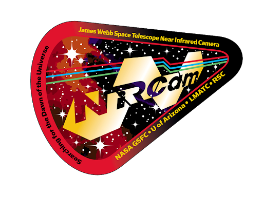

# CAR_NIRCAM-033: LW GRISM Stability

 

## Description

***GOALS:***

The goal of this activity is to assess the stability on the grism time series mode using astrophysical targets that show signals similar to a transiting exoplanet using both long-wave (LW) grism observations as well as short-wave (SW) simultaneous photometry with a weak lens. While it is possible to stareat a constant flux source, an eclipsing binary star system is preferred because it will induce a known change in flux at a known time. This will allow us to accurately assess the ability of the STScI data reduction and analysis pipeline to simultaneously remove instrumentalnoise while preserving astrophysical signals. These observations will specifically:
* Measure any persistence-related phenomena (such as the well-known HST WFC3 ramp-up type behavior) and their timescales
* Verify that NIRCam grism time series can recover the correct change in flux of a known signal with a known ephemeris
* Measure of the changes in flux with telescope pointing or jitter, if any
* An estimate of the systematic noise floor of the NIRCam photometric and grism time series and verify it is below our goal of 100 ppm.
* Assess if it is necessary to modify the configuration of the grism time series such as using a different subarray, module, or grism element

***PRIMARY AND BACKUP TARGET:***

The nominal target for these observations will be the HD 140982 system. While this target’s visibility window is misaligned with the expected commissioning dates (see visibility above), we also have a backup target: HD 5687.

HD 140982A shows (0.86%) eclipses in archival data from the KELT transit survey. The KELT pixel scale (23”/px) includes blended sources in its lightcurves. Therefore, ground-based photometry was performed on the University of Arizona 90-inch telescope to verify that HD 140982 was not a fainter background eclipsing binary blended by HD 140982. The 90-inch observations confirm that HD 140982 is indeed the eclipsing binary and hasa primary eclipse of 2%. TESS is expected to collect lightcurves of the HD 140982 system in sectors 22, 23, and 24, all with camera 3. These observations are expected to be in February through April 2020 according to the WebTESS Viewing Tool accessed on April 19, 2019. TESS will provide high precision lightcurves to constrain the variability and eclipse timing ephemeris of the system but will experience similar blending as KELT.

Radial velocity observations show that HD 140982B is a late M-dwarf companion.The system is relatively bright (K=7.6), shows a short 1.3 hour eclipse, and has a high ecliptic latitude of 73 degrees. Data collection will take 4 hours for the exposure itself to include 1.7 hours before eclipse, 1.3 hours during eclipse and 1 hour after. The total time charged with overhead is 4.84 hours.

A backup eclipsing binary that has complementary visibility is HD 5687/TIC 51912829. It was originally flagged as a planet candidate and then later classified as an eclipsing binary. Its eclipse depth is smaller (0.3% in TESS but this is potentially diluted by nearby sources). AO imaging shows no bright neighboring stars. Because of the similar orbital period, eclipse duration and magnitude, this target can be substituted for the primary target with no significant impact to the duration or data volume (the much smaller eclipse depth makes this a less desirable target).

***OBSERVING SPECIFICATIONS:***

In order to commission this observing mode, the following observations, defined using the grism time-series template of one of the targets above should be collected:
* **LW Channel: GRISMR + F322W2, SUBGRISM256, NOUTPUTS=4**
* **SW Channel: WLP8+F210M, SUBGRISM256, NOUTPUTS=4**

These exposures, which collect data from 3 detectors, will generate a total of 30.3GB of science data. The time-series template uses unique and very specific field points and allows the use of subarrays. Observations are only supported on Module A, and only for the GRISMR element. Photometric repeatability is critical for this science case, so a long exposure is needed to assess the stability on hours-long timescales.

**ACTIVITY EXECUTION METHOD:** OPE commanding and standard APT templates. 
**CRITICAL START WINDOW?** Yes (there is a phase constraint for the binary star eclipse)
**IF YES, NO-LATER-THAN START TIME:** No
**REAL-TIME CONTACT REQUIRED?** No
**DURATION:** (APT 27.1, includes initial slew) **Grism time-series: 4.84 hours.** ***After analysis of all the data from this activity (estimated to require 4 days), NIRCam grism time-series can be considered enabled.***
**DATA REQUIREMENTS:** (APT 27.1 estimate) **Grism time-series: 30.3 GB**
**IS YOUR INSTRUMENT DRIVING TELESCOPE POINTING?** Yes
**IS THIS ACTIVITY PREFERABLY DONE IN PARALLEL?** No

***ANALYSIS AND EXPECTED RESULTS:***
As noted above, this data will be used to assess the time series stability. 
**Weak Lens and Grism Time Series Extraction:**
The short wavelength weak lens data will be extracted with aperture photometry and Gaussian centroiding on the central peak. The centroiding will be used to determine pointing jitter and if it has any effect on photometry or the grism. The spectrum will be extracted with optimal estimation and broken into individual wavelength time series.
**Analysis:**
The time series will be fit with transitlight curves and the residuals will be assessed for photometric stability. The centroids from the weak lens will be correlated against any flux changes. A final estimate ofthe residuals will be calculated for each wavelength. Expected precision is 51 ppm per spectral wavechannel at a spectral resolution of R=100.

***AUTHORS:***
* Everett Schlawin (UArizona): eas342@email.arizona.edu
* Thomas Beatty (UArizona): tgbeatty@email.arizona.edu
* Thomas P Greene (NASA Ames): tom.greene@nasa.gov
* John Stansberry (STScI): jstans@stsci.edu

***REPOSITORY AUTHOR:***
* Arsh Nadkarni (UArizona): arshn2000@email.arizona.edu
